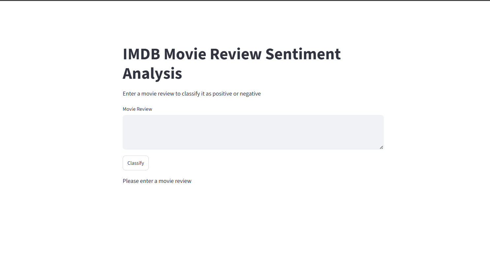
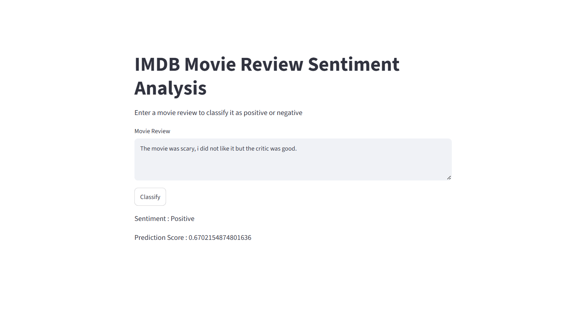

# 🎬 IMDB Sentiment Analysis — Simple RNN

**Classify any movie review as Positive or Negative in real time — powered by a Recurrent Neural Network trained from scratch on 50,000 IMDB reviews.**

[](https://imdb-sentiment-rnn-garv.streamlit.app/)
[](https://www.python.org/)
[](https://www.tensorflow.org/)
[](https://keras.io/)
[](https://streamlit.io/)

[**Live Demo**](https://imdb-sentiment-rnn-garv.streamlit.app/) · [**Report a Bug**](https://github.com/garvkumarsharma/IMDB-Sentiment-Analysis-Simple-RNN/issues) · [**Request a Feature**](https://github.com/garvkumarsharma/IMDB-Sentiment-Analysis-Simple-RNN/issues)

---

## 📖 About The Project

**IMDB Sentiment Analysis** is an end-to-end deep learning project that predicts whether a movie review expresses positive or negative sentiment. Type in any review — a real one, or something you make up — and the model returns a sentiment label along with a raw confidence score.

Rather than calling a pre-built sentiment API, this project builds the entire pipeline from first principles: turning raw text into trainable word embeddings, feeding those embeddings through a Simple Recurrent Neural Network to capture sequential context, and training the whole thing end-to-end on the classic IMDB movie reviews dataset — then wrapping it in a Streamlit app for real-time inference.

This project was built to practice core sequence-modeling fundamentals — embeddings, recurrent layers, padding/masking, and the practical debugging that comes with deploying a trained model — rather than using a pre-trained transformer out of the box.

### 🎯 What It Does

Type any movie review into the app, and it will:

1. ✂️ Tokenize and lowercase the review into individual words
2. 🔢 Map each word to its IMDB vocabulary index (unknown/rare words fall back to an out-of-vocabulary token)
3. 📏 Pad the sequence to a fixed length of 500 tokens
4. 🧠 Pass it through a trained Embedding → SimpleRNN → Dense pipeline
5. 📊 Output a **Positive** / **Negative** label with a raw sigmoid confidence score

---

## 🔗 Live Demo

> ### 👉 **[imdb-sentiment-rnn-garv.streamlit.app](https://imdb-sentiment-rnn-garv.streamlit.app/)**

No installation needed — open the link, type in a review, and click Classify.

**Repository:** [github.com/garvkumarsharma/IMDB-Sentiment-Analysis-Simple-RNN](https://github.com/garvkumarsharma/IMDB-Sentiment-Analysis-Simple-RNN)

---

## 🖼️ Screenshots

| App UI | Prediction Output |
|---|---|
|  |  |

> Add your own screenshots to a `screenshots/` folder in the repo and update the paths above.

---

## ✨ Key Features

- 📝 **Real-time sentiment prediction** on any user-typed review, not just pre-loaded dataset samples
- 🧠 **Trained-from-scratch word embeddings** — 128-dimensional vectors learned directly from the IMDB vocabulary, not a pre-trained embedding table
- 🔁 **Sequential context modeling** via a `SimpleRNN` layer, capturing word order rather than treating a review as a bag of words
- 🎭 **Masking-aware architecture** (`mask_zero=True`) so padded tokens don't distort predictions on short reviews
- 🛑 **Early stopping** during training (`restore_best_weights=True`) to prevent overfitting and automatically keep the best checkpoint
- ⚡ **Cached model & vocabulary loading** in the Streamlit app, so the ~5 MB model and word index load once per session instead of on every click
- 🧪 **Two companion notebooks** — one exploring word embeddings from first principles, one for ad-hoc prediction testing outside the app

---

## 🏗️ How It Works — Architecture

```
                 ┌───────────────────┐
Raw Review ────▶ │  preprocess_text() │  → Lowercase, split, map words → indices (+3 offset)
                 └─────────┬──────────┘
                           ▼
                 ┌───────────────────┐
                 │  pad_sequences      │  → Pads/truncates to a fixed length of 500 tokens
                 └─────────┬──────────┘
                           ▼
                 ┌───────────────────┐
                 │  Embedding Layer    │  → 10,000-word vocab → 128-dim dense vectors (mask_zero=True)
                 └─────────┬──────────┘
                           ▼
                 ┌───────────────────┐
                 │   SimpleRNN Layer   │  → 128 units, tanh activation, sequential context
                 └─────────┬──────────┘
                           ▼
                 ┌───────────────────┐
                 │  Dense (sigmoid)    │  → Single neuron → probability of Positive sentiment
                 └─────────┬──────────┘
                           ▼
              Sentiment Label + Confidence Score (in-app)
```

**Model summary:**

| Layer         | Output Shape     | Parameters |
|---------------|------------------|------------|
| Embedding     | (None, 500, 128) | 1,280,000  |
| SimpleRNN     | (None, 128)      | 32,896     |
| Dense         | (None, 1)        | 129        |

**Total parameters:** 1,313,027

---

## 🛠️ Tech Stack

| Layer               | Technology                                                                 |
| ------------------- | --------------------------------------------------------------------------- |
| **Model**           | Simple RNN (`tensorflow.keras.layers.SimpleRNN`) with an Embedding front-end |
| **Training Data**   | [IMDB Movie Reviews](https://keras.io/api/datasets/imdb/) (`tensorflow.keras.datasets.imdb`) — 50,000 labeled reviews |
| **Framework**       | [TensorFlow](https://www.tensorflow.org/) / [Keras 3](https://keras.io/)     |
| **UI / Frontend**   | [Streamlit](https://streamlit.io/)                                          |
| **Deployment**      | Streamlit Community Cloud                                                    |
| **Language**        | Python 3.11                                                                  |

---

## 📂 Project Structure

```
IMDB-Sentiment-Analysis-Simple-RNN/
├── main.py                 # Streamlit UI — main entry point for deployment
├── simpleRNN.ipynb          # Model training notebook (data prep, architecture, training, saving)
├── prediction.ipynb         # Notebook for ad-hoc prediction testing outside the app
├── embeddings.ipynb         # Standalone notebook exploring word embeddings from first principles
├── simple_rnn_imdb.h5        # Trained model weights (Keras H5 format)
├── requirements.txt          # Python dependencies
├── .gitignore                # Excludes .venv/, __pycache__/, .ipynb_checkpoints/
└── README.md
```
> **Note:** `simpleRNN.ipynb` produces `simple_rnn_imdb.h5`, which `main.py` loads directly at runtime. `prediction.ipynb` and `embeddings.ipynb` are kept as standalone reference notebooks for experimentation outside the web UI.

---

## 🚀 Getting Started — Run It Locally

### Prerequisites

- Python 3.11 or higher

### Installation

**1. Clone the repository**
```
git clone https://github.com/garvkumarsharma/IMDB-Sentiment-Analysis-Simple-RNN.git
cd IMDB-Sentiment-Analysis-Simple-RNN
```

**2. Create and activate a virtual environment**
```
python -m venv .venv

# Windows
.venv\Scripts\activate

# macOS/Linux
source .venv/bin/activate
```

**3. Install dependencies**
```
pip install -r requirements.txt
```

**4. Run the app**
```
streamlit run main.py
```

The app will open at `http://localhost:8501`. Type in a review and click **Classify**.

---

## ☁️ Deployment

This project is deployed on **Streamlit Community Cloud**, connected directly to this GitHub repository.

**Live app:** [imdb-sentiment-rnn-garv.streamlit.app](https://imdb-sentiment-rnn-garv.streamlit.app/)

If you'd like to deploy your own fork:

1. Push your fork to GitHub
2. Go to [share.streamlit.io](https://share.streamlit.io) → **Create app**
3. Point it at your repo, branch `main`, main file `main.py`
4. Deploy 🚀

Streamlit Cloud installs everything from `requirements.txt` automatically — no secrets or API keys are required for this project.

---

## 🧭 Roadmap / Future Improvements

- [ ] Replace `SimpleRNN` with `LSTM` / `GRU` for stronger long-range context handling
- [ ] Use pre-trained embeddings (GloVe / Word2Vec) instead of training embeddings from scratch
- [ ] Add a visual confidence bar/gauge in the UI
- [ ] Support batch predictions via CSV upload
- [ ] Add a model comparison view (SimpleRNN vs. LSTM vs. GRU side by side)

---

## 👤 Author

**Garv Kumar Sharma**

- GitHub: [@garvkumarsharma](https://github.com/garvkumarsharma/)
- LinkedIn: [linkedin.com/in/garv-kumar-sharma](https://www.linkedin.com/in/garv-kumar-sharma)

---

## 📄 License

This project is open source and available under the [MIT License](LICENSE).

---

If you found this project interesting, consider giving it a ⭐ on GitHub!
